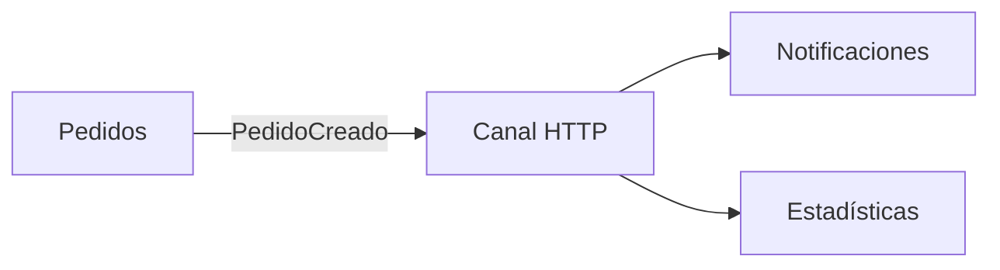

# Tema 3: publicación/suscripción y eventos

Repositorio didáctico en Node.js para el coloquio. Un pedido publica `PedidoCreado`; un canal entrega **el mismo evento** a dos consumidores independientes: notificaciones y estadísticas. Cuatro contenedores, cero dependencias de npm. [Guion de la exposición](GUIA_COLOQUIO.md).

## Arquitectura



| Contenedor | Responsabilidad | Puerto dentro de Compose |
|---|---|---:|
| `pedidos` | Crea pedidos y publica el evento. No conoce las URLs de los consumidores. | 8080, expuesto en `127.0.0.1:8080` |
| `canal` | Distribuye una copia del evento a cada consumidor. | 8081 |
| `notificaciones` | Registra un aviso simulado por evento. | 8082 |
| `estadisticas` | Cuenta pedidos creados, evitando contar dos veces el mismo ID. | 8083 |

Los servicios se encuentran por su nombre dentro de la red de Compose. Cada proceso mantiene su propio estado **en memoria**.

## Requisitos

- Docker Desktop (Windows/macOS) o Docker Engine con Docker Compose (Linux), iniciado.
- Acceso inicial para descargar la imagen `node:24-alpine`.
- Puerto 8080 libre. Si está ocupado, cambien **solo el primer 8080** de `127.0.0.1:8080:8080` en `compose.yaml`.
- No hace falta instalar Node en la computadora anfitriona; los scripts se ejecutan dentro de los contenedores. No hace falta npm ni pnpm porque el ejemplo usa únicamente módulos de Node.

## Ejecución desde la raíz del repositorio

```bash
docker compose up --build -d
docker compose ps
```

Esperar hasta ver los cuatro servicios en estado `Up` o `running`. Si alguno no inició, consultar `docker compose logs --no-color --tail=40`.

### Prueba A: dos consumidores reciben el mismo evento

```bash
docker compose exec -T pedidos node demo.mjs
docker compose logs --no-color --tail=25 pedidos canal notificaciones estadisticas
```

El script verifica automáticamente que:

1. Pedidos creó un pedido con estado `CREADO`.
2. El canal reportó `OK` para los dos consumidores.
3. Notificaciones registró un aviso cuyo ID de evento coincide con el publicado.
4. El contador de estadísticas aumentó **exactamente en uno**.

Los IDs se generan en cada corrida. Si repiten el script, el contador acumula nuevos pedidos.

### Prueba B: falla un consumidor, el otro sigue funcionando

```bash
docker compose stop notificaciones
docker compose exec -T pedidos node fallo.mjs
docker compose logs --no-color --tail=25 canal estadisticas
docker compose start notificaciones
```

El canal reporta `ERROR` para notificaciones y `OK` para estadísticas; el contador aumenta en uno. **El aviso perdido no se recupera al reiniciar notificaciones**, porque el canal de esta práctica no almacena ni reintenta mensajes. Detener un contenedor ilustra también una limitación real que deben explicar al cerrar.

### Finalizar

```bash
docker compose down
```

Para empezar con contadores y registros vacíos, ejecuten `docker compose down` y luego `docker compose up --build -d`.

## Respaldo ante inconvenientes

El archivo [evidencias/ejecucion-local.log](evidencias/ejecucion-local.log) conserva la salida real de las pruebas A y B ejecutadas con los mismos procesos Node fuera de Docker. [evidencias/servicios-local.log](evidencias/servicios-local.log) conserva los registros de esos procesos. Son **logs locales**, identificados como tales; no son capturas de una ejecución con Docker.

Antes del coloquio, después de ensayar Docker en su computadora, guarden el respaldo correspondiente:

```bash
docker compose ps > evidencias/docker-servicios.txt
docker compose logs --no-color > evidencias/docker-logs.txt
```

También pueden capturar la salida de las dos pruebas y una imagen donde se vean los cuatro contenedores. Los archivos de respaldo del repositorio permiten seguir la explicación si falla la proyección o la red del aula.

## Alcance técnico y límites

- Este canal usa HTTP y **espera** las respuestas de los dos consumidores para exhibir las entregas. Implementa la idea de fan-out para fines didácticos, **no** es RabbitMQ ni Kafka y no tiene colas duraderas ni consumo asincrónico desacoplado del tiempo de respuesta.
- Si un consumidor no responde, se registra `ERROR` para ese destinatario; no hay reintento ni entrega posterior. El estado se pierde cuando se reinicia cualquier contenedor.
- Pedidos guarda el pedido y luego publica el evento. Si falla el canal en ese intervalo, queda un pedido creado sin notificación. Un sistema real puede usar una outbox transaccional y consumidores idempotentes para tratar este problema.
- La deduplicación por ID en los consumidores funciona solo durante la vida de cada proceso. En producción se almacenaría persistentemente.
- `PedidoCreado` significa que el pedido **existe**; no afirma que esté pagado o confirmado. Esta práctica no incluye pagos ni sagas.

## Fuentes para la exposición

- [AWS Prescriptive Guidance: Publish-subscribe pattern](https://docs.aws.amazon.com/prescriptive-guidance/latest/cloud-design-patterns/publish-subscribe.html).
- [RabbitMQ Tutorial: Publish/Subscribe](https://www.rabbitmq.com/tutorials/tutorial-three-javascript).
- [AWS Prescriptive Guidance: Transactional outbox](https://docs.aws.amazon.com/prescriptive-guidance/latest/cloud-design-patterns/transactional-outbox.html).
- [Docker Docs: Networking in Compose](https://docs.docker.com/compose/how-tos/networking/).
