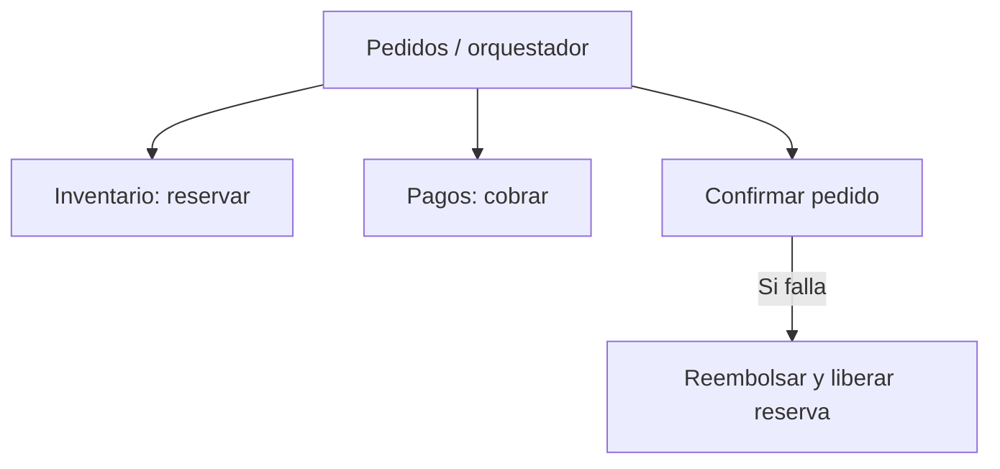

# Tema 11: saga y transacciones distribuidas

Repositorio didáctico en Node.js con tres servicios separados mediante Docker Compose: pedidos, inventario y pagos. Una compra exitosa reserva y cobra; otra falla a propósito al confirmar y ejecuta compensaciones. [Guion de exposición](GUIA_COLOQUIO.md) · [Monólogo slide por slide](MONOLOGO.md) · [Diagrama de secuencia (abrir en el navegador)](diagramas/saga-secuencia.html).



## Requisitos

- Docker Desktop o Docker Engine con Compose iniciado.
- Conexión inicial para descargar `node:24-alpine`.
- Puerto 8090 libre. Solo `127.0.0.1:8090` se expone a la computadora anfitriona.
- No hace falta instalar Node ni paquetes de npm o pnpm en la computadora: se usan módulos nativos dentro de los contenedores.

## Cómo ejecutarlo

Desde la raíz del repositorio:

```bash
docker compose up --build -d
docker compose ps
docker compose exec -T pedidos node demo.mjs
docker compose logs --no-color --tail=45 pedidos inventario pagos
```

El script `demo.mjs` crea **dos pedidos distintos** y verifica automáticamente:

1. Compra normal: estado `CONFIRMADO`, una unidad permanece reservada y el pago está `COBRADO`.
2. Compra con `failConfirmation: true`: después de reservar y cobrar, falla la confirmación.
3. Compensación: el pago termina `REEMBOLSADO`, la reserva de ese pedido desaparece, el stock vuelve al valor que tenía antes del pedido fallido y el pedido queda `CANCELADO`.

**Cómo leer el stock:** si ejecutan el script tras un inicio limpio, el stock parte de 5, pasa a 4 por el pedido exitoso y permanece en 4 después de cancelar el fallido. En repeticiones, comparen `stockBefore` y `stockAfter` del caso B; no asuman que siempre empieza en 5.

**Para reiniciar el estado:**

```bash
docker compose down
docker compose up --build -d
```

**Para apagar los contenedores:** `docker compose down`.

## Quién hace qué

| Servicio | Estado propio | Endpoints del flujo |
|---|---|---|
| Pedidos | Estado de cada pedido y orden de la saga. | `POST /pedidos`, `GET /estado` |
| Inventario | Stock y reservas por ID de pedido. | `POST /reservar`, `POST /liberar`, `GET /estado` |
| Pagos | Registro de cobros y reembolsos por ID de pedido. | `POST /cobrar`, `POST /reembolsar`, `GET /estado` |

Pedidos actúa como **orquestador**: decide el orden de los pasos. Las compensaciones se registran una vez que cada paso informa éxito y se intentan en orden inverso. Los servicios se comunican por HTTP mediante los nombres que les asigna Compose.

## Evidencia de respaldo

- [evidencias/ejecucion-local.log](evidencias/ejecucion-local.log) y [evidencias/servicios-local.log](evidencias/servicios-local.log): prueba local de los procesos Node, sin Docker.
- [evidencias/docker-servicios.txt](evidencias/docker-servicios.txt) y [evidencias/docker-logs.txt](evidencias/docker-logs.txt): salida de `docker compose ps` y `docker compose logs` de una ejecución real en contenedores.

Para regenerarlas en su computadora después de correr la demo:

```bash
docker compose ps > evidencias/docker-servicios.txt
docker compose logs --no-color > evidencias/docker-logs.txt
```

Conviene guardar también una captura donde se vea el estado final de los dos pedidos o grabar un video breve como respaldo si la demostración en vivo falla.

## Qué demuestra y qué no

- Los tres procesos mantienen estados independientes **en memoria**, sin bases de datos. Las acciones simulan las transacciones locales, pero no son transacciones ACID reales.
- El pago es un registro simulado: no hay dinero ni pasarela. `REEMBOLSADO` representa una acción compensatoria, no un rollback global.
- Esta saga es **orquestada**: pedidos coordina inventario y pagos. No intervienen eventos de pub/sub; ese es el otro tema del coloquio.
- El flujo es secuencial y responde cuando terminó toda la operación. Al reiniciar contenedores se pierde el estado. Un sistema real persistiría el progreso de la saga y el resultado de cada paso.
- Si se pierde la respuesta de una llamada después de que el servicio remoto hizo el cambio, el orquestador puede no saber qué ocurrió. En producción se necesitan identificadores idempotentes, consulta y conciliación antes de compensar o repetir operaciones.
- Si una compensación falla, la demo marca `REQUIERE_INTERVENCION`. En producción harían falta reintentos, alertas y un procedimiento de resolución.

## Fuentes

- [AWS Prescriptive Guidance: Saga patterns](https://docs.aws.amazon.com/prescriptive-guidance/latest/cloud-design-patterns/saga-patterns.html).
- [AWS Prescriptive Guidance: Saga orchestration](https://docs.aws.amazon.com/prescriptive-guidance/latest/cloud-design-patterns/saga-orchestration.html).
- [Microservices.io: Saga pattern](https://microservices.io/patterns/data/saga.html).
- [Docker Docs: Networking in Compose](https://docs.docker.com/compose/how-tos/networking/).
